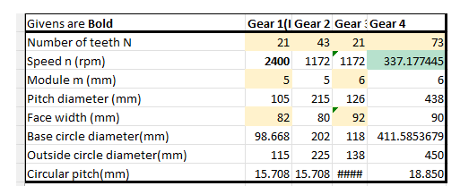
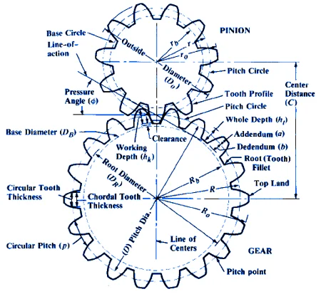
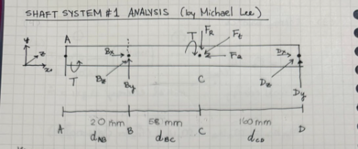
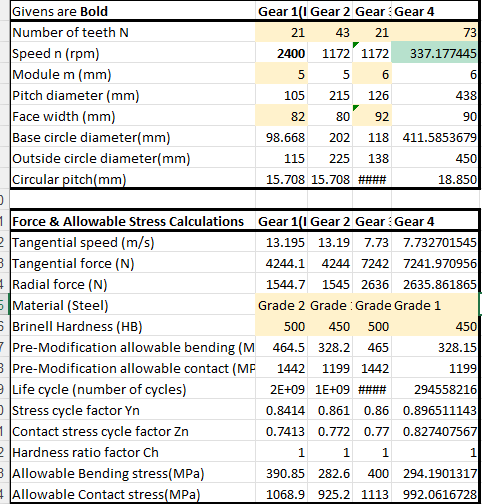
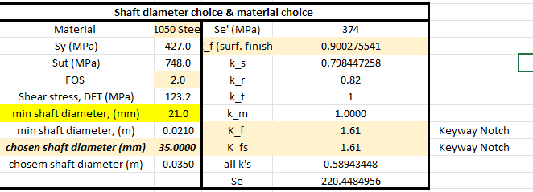
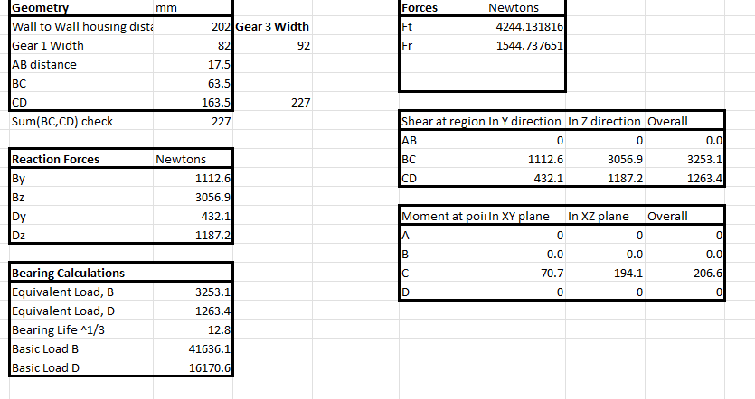

___
# 1. Background
As the final project of our Machine Elements Design course, I designed 1 shaft in a 3-shaft gear reducer, incorporating everything learned from the class about shafts, gears, bearings, contact/bending stresses, and fatigue/static yield failure. I also produced detailed CAD models & drawings of gears, bearings, and my designed shaft in Siemens NX and collaborated with two teammates to integrate them into one large assembly model.

    <iframe src="https://docs.google.com/presentation/d/e/2PACX-1vQG_McPhKvFBsuw2LDGHxuXSB6aA12-aKvQyAJqzWL7-BxF1-HDdVB8JkuLruBcSyKolczrH4xSrdHe/pubembed?start=true&loop=true&delayms=10000"
            frameborder="0"
            width="100%"
            height="540"
            allowfullscreen="true"
            mozallowfullscreen="true"
            webkitallowfullscreen="true">
    </iframe>

# 2. Design Requirements
- 56kW system that converts a 2400 rpm input into target output of 340 rpm
- N (number of cycles) > 10 million revolutions ("infinite life") -> select appropriate commercial bearings.
- Factors of safety for fatigue & yield failure > 1.27 on all shafts AND for contact, bending stresses of gears.

# 3. Final Design Specifications

  

    
  

# 4. Calculations and detailed analysis

### 4.1. Gear Parameters

First, we chose modules for the first 2 gears and last 2 to be 5mm and 6mm, respectively. Given the constraint of input of 2400 rpm and output of 340 rpm, and choosing combinations of gear teeth to reach close to the output of 340rpm (used a spreadsheet to test different values). 

> [!warning] Note to self
> Add justification above!!

With the chosen number of teeth for each gear, we achieved a 337rpm output, representing a 3rpm difference from target, or $\approx 0.88\% $ from target.
> [!warning] Important
> For this project, we decided this deviation of $<1\%$ to be acceptable. **However, if the application requires a more precise rpm decrease, we would need to adjust the number of teeth continuously, or consider using non-spur gears.**

To calculate pitch diameter (mm) for each gear, multiply each gear module by its number of chosen teeth.

For face width (mm), multiply 16 by the module and add 2. 

The pressure angles for the Gear 1/Gear 2 and Gear 3/Gear 4 meshing pairs were chosen to be the common 20 degrees for spur gears, offering a good balance of high power transmission and better lubrication.

From that info, the base circle diameter, outside circle diameter, and circular pitch for each gear were calculated with the following formulas:

Pitch diameter, $D$
Base circle diameter, $$ D_{B} = D\cos(\phi) $$; pressure angle, $\phi=20^\circ$
Outer circle diameter $$ D_{O} = D+2m$$
Circular pitch, $$ p = m\pi$$, 

Next is to make sure the contact ratio (CR) of the two gear pairings are > 1 ensuring continuous operation by allowing new pair of teeth to engage before previous pair disengages, reduced noise, and lower stress per tooth because the same load is shared across more teeth at any given time.

$$
  CR = \frac{
    \sqrt{R_{B}^2-R^2\cos^2(\phi)} + \sqrt{r_{B}^2-r^2\cos^2(\phi)} - (R+r)\sin(\phi)
  }{\pi m \cos(\phi)}
$$
where:

$R_B = \frac{D_B}{2} =$ outside circle radius of 1st gear
$R = \frac{D}{2} =$ pitch radius of 1st gear
$r_B = \frac{D_B}{2} =$ outside circle radius of 2nd gear
$r = \frac{D}{2} =$ pitch radius of 2nd gear

With these formulas, the calculated contact ratios between Gear 1/Gear2 ($CR_{12}$) and Gear3/Gear4 ($CR_{34}$) are: 

$\boxed{CR_{12} \approx 1.648 > 1}$ $\boxed{CR_{34} \approx 1.691 > 1}$

Thus, we confirm that the two gear pairs mesh in continuous manner.

### 4.2. Gear Forces & Initial Shaft Analysis

> [!note] Important Note
> In order to refine the analysis, after choosing bearings and gears and determining widths, come back to the FBD.

### 4.3 Shaft Design

> [!note] Important Note
> taking into account "min shaft diameter" based on FOS of 2.0

### 4.4 Bearing Selection

### 4.5 Detailed CAD models & Technical drawings

# 5. Results & Reflections

Through this project, I successfully designed a 3-shaft gear reducer that meets all specified design requirements with factors of safety well above the 1.27 minimum across all failure modes. The design process reinforced my understanding of fatigue analysis, gear geometry, and the critical importance of validation through both analytical methods and CAD modeling.

Using Siemens NX for the CAD work and collaborating with teammates on the assembly integration demonstrated how individual component design must align with system-level requirements. The selection of commercial bearings and gears required careful consideration of real-world availability, not just theoretical performance.

The systematic approach of iteratively refining shaft geometry, selecting appropriate materials, and validating against fatigue, yield, contact, and bending criteria ensures confidence that this design would perform reliably under the specified operating conditions.

