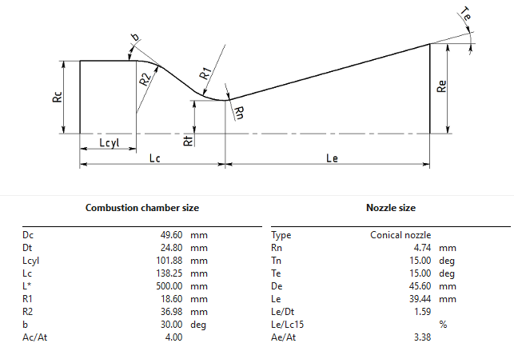

___
> [!note]
> This is a new and ongoing project started on September 14, 2026.

# 1. Background
I love rockets! Some skills & software I plan to learn/improve upon:
- **CFD & FEA**: I plan to run the same simulations in ANSYS and Star-CCM+.
- **CAD**: I plan to make parts, assemblies, and drawings in both Siemens NX and SolidWorks.
- **Fluid Systems**: I plan to design the plumbing for the propellant feed system and a static-fire test stand.

# 2. Nozzle & Combustion Chamber Design
## 2.1 Initial specs
My initial chosen design specs are: 

| Parameter | Value |
| ------ | ------- |
| Thrust (T) | 250 lbf |
| Chamber pressure (Pc) | 250 psi |
| Nozzle exit pressure | 1 atm (14.696 psi)| 
| Oxidizer-to-fuel (O/F) ratio | optimal ~8 |
| Oxidizer/Fuel | liquid nitrous oxide & E85 gas|
| Nozzle shape | conical (15 deg half-angle) |
| Characteristic length (L*) | 50cm | 
| Contraction area ratio (Ac/At) | 4 | 

Thrust and chamber pressure values lie in the typical range for amateur liquid rockets (50-500lbf) and (100-500psi), but the values of 250lbf and 250psi were chosen arbitrarily (nice numbers). I'm designing this for a (hopefully) eventual test-fire at sea-level, so 1 atm for the exit pressure. Initially, I'll use the optimal O/F ratio for maximum specific impulse (Isp), but may need to adjust this due to thermal constraints. Nitrous oxide is a common oxidizer and E85 is readily available at the local gas station, so that's why I chose this combination. L* should be between [40 and 120cm](https://arc.aiaa.org/doi/pdf/10.2514/6.2025-99491) to allow proper residence time in the combustion chamber. For the initial, I am sticking with 50cm. Contraction ratios typically vary from 2 to 10 for rocket engines - I am starting at 4 for now and iterating as necessary (See section 2.2).

# 2.2 Nozzle contour 
The nozzle contour can be tweaked by adjusting the characteristic length L*, nozzle exit pressure, and contraction area ratio (Ac/At). Using the initial chosen values and [Rocket Propulsion Analysis (RPA)](https://www.rocket-propulsion.com/index.htm) Software generates the following contour:

However, these dimensions (notably chamber diameter, throat diameter, and exit diameter) are too small for my liking, so I tweaked the L* value as follows: 
> [!warning]
> This is the current progress of my project. Check back for more! I will update as I develop this project.

