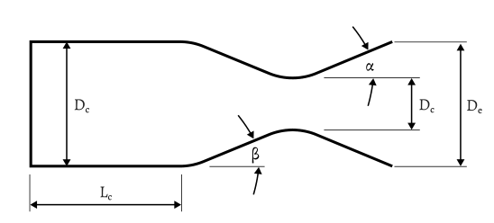
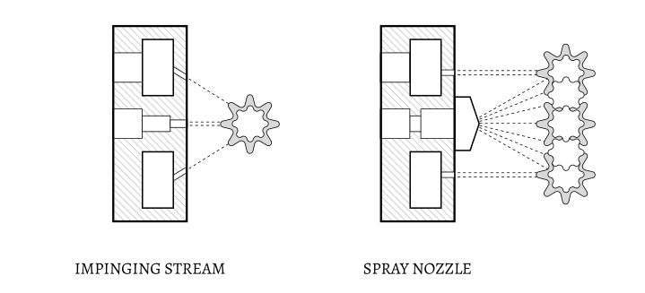

___
> [!note]
> This is a new and ongoing project started on September 14, 2026.

# Background
I love rockets! Some skills & software I plan to learn/improve upon:
- **CFD & FEA**: I plan to run the same simulations in ANSYS and Star-CCM+.
- **CAD**: I plan to make parts, assemblies, and drawings in both Siemens NX and SolidWorks.
- **Fluid Systems**: I plan to design the plumbing for the propellant feed system and a static-fire test stand.
___

# Nozzle & Combustion Chamber Design
> [!warning] Work in Progress
> Update with my nozzle & combustion chamber geometry in CAD. 

[**View Page**](/nozzle-and-chamber)

<!-- # Fuel Injector Design

[!warning] Work in Progress
> Update with my injector geometry in CAD. WORK IN PROGRESS.

[**View Page**](/nozzle-and-chamber) -->

