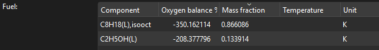
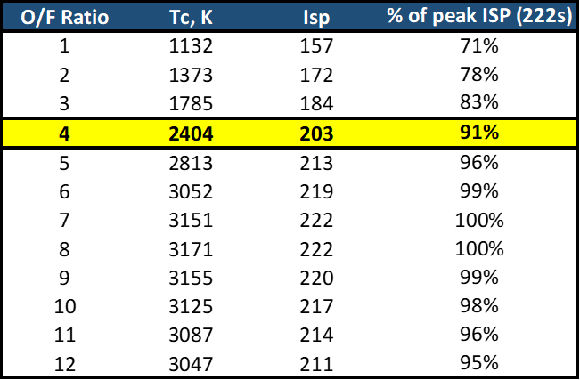
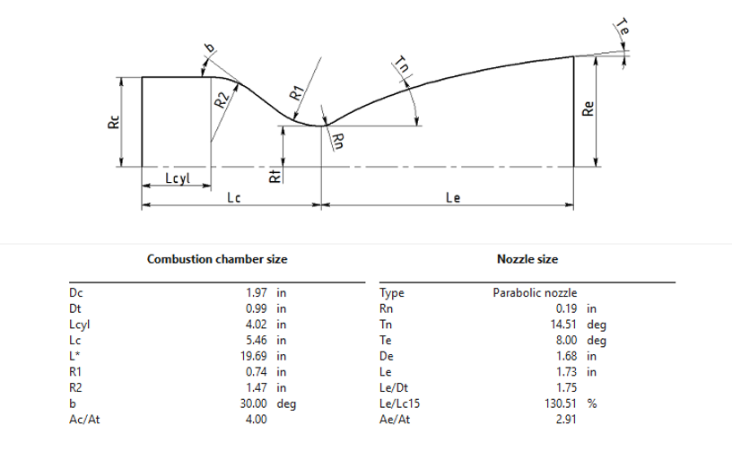
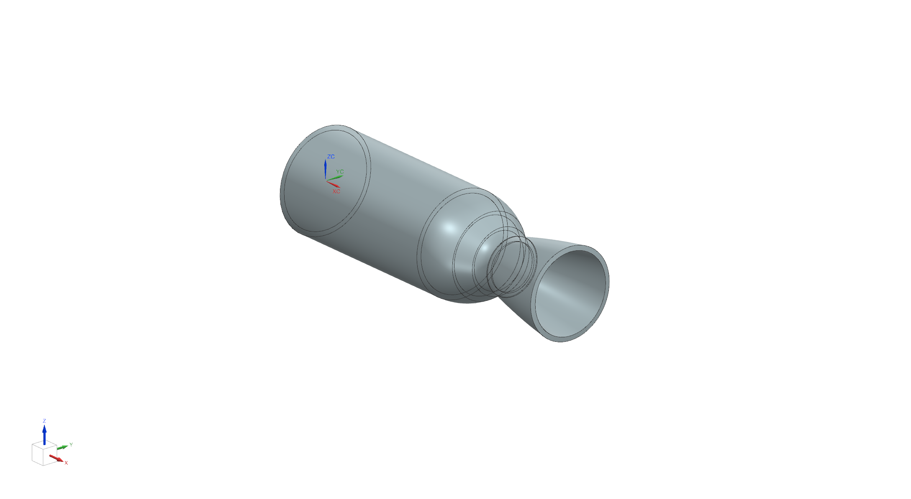

# Initial specs
My initial chosen design specs were: 

| Parameter | Value |
| ------ | ------- |
| Thrust (T) | 250 lbf |
| Chamber pressure (Pc) | 250 psi |
| Nozzle exit pressure | 1 atm (14.696 psi)| 
| Oxidizer-to-fuel (O/F) ratio | optimal ~8 |
| Oxidizer/Fuel | liquid nitrous oxide & E85 gas|
| Nozzle shape | Bell nozzle |
| Characteristic length (L*) | 50cm | 
| Contraction area ratio (Ac/At) | 4 | 

Thrust and chamber pressure values lie in the typical range for amateur liquid rockets (50-500lbf) and (100-500psi), but the values of 250lbf and 250psi were chosen arbitrarily (nice numbers). 

I'm designing this for a (hopefully) eventual test-fire at sea-level, so 1 atm for the exit pressure. 

Initially, I'll use the optimal O/F ratio for maximum specific impulse (Isp), but may need to adjust this due to thermal constraints. 

Nitrous oxide is a common oxidizer and E85 is readily available at the local gas station, so that's why I chose this combination. 

L* should be between [40 and 120cm](https://arc.aiaa.org/doi/pdf/10.2514/6.2025-99491) to allow proper residence time in the combustion chamber. For the initial, I am sticking with 50cm. 

Contraction ratios typically vary from 2 to 10 for rocket engines - I am starting at 4 for now and iterating as necessary.

# O/F ratio Calculations & Iteration
[Rocket Propulsion Analysis (RPA)](https://www.rocket-propulsion.com/index.htm) does not have E85 gas as a chemical species for its combustion analysis, so I created a custom one. First, define the volume fractions of ethanol and iso-octane, assuming E85 is 85% ethanol (i.e. $V_{eth} = 0.85$), and 15% gasoline (i.e. $V_{gas} = 0.15$), represented by iso-octane as a first-order estimate.  We will assume standard temperature and pressure (STP) conditions of $1 atm$ (where this engine is designed to fire at) and $25^\circ C$ and start with the density from which can be found from online databases: $$\rho_{eth} = 0.7850 g/cm^3$$ and $$\rho_{gas} = 0.6878g/cm^3$$. Now, the mass fractions $M$ can be calculated from masses $m$:

$$m_{E85} = \rho_{eth}V_{eth} + \rho_{gas}V_{gas} = 0.77042g$$
$$M_{eth} = \frac{\rho_{eth}V_{eth}}{m_{E85}} = 0.8661 $$
$$M_{gas} = \frac{\rho_{gas}V_{gas}}{m_{E85}} = 0.1339 $$

This tells us that in E85 gas, approximately $86.61\%$ of the mass is ethanol and $13.39\%$ is gasoline. Inputted into RPA for analysis: 

Initial RPA results with an optimal O/F ratio of $\approx 8$ led to a chamber temperature of $T_c \approx 3171K$. I then did an O/F ratio and $I_{sp}$ (specific impulse) vs $T_c$ analysis to inform a more balance design that
- **(1) minimally sacrifices $I_{sp}$ (i.e. efficiency)** and
- **(2) reasonably reduces the combustion temperature for easier material selection, allowing simpler cooling methods** 

From the study, I chose to go with a revised O/F ratio of 4 in order to reduce $T_c$ significantly to $2404K$, while at the same time retaining $91\%$ of the theoretical maximum $I_{sp}$ value of $222 sec$. I believe this to be a fair trade-off: the temperature is reduced significantly, but not to the point where engine efficiency suffers greatly- at least for the scope of this project.

# Nozzle Contour Calculations & Iteration
With the new O/F ratio, and thus, the combustion simulation of the thrust chamber complete, we can now determine the exact nozzle contour for import into CAD. Using the chosen nozzle exit pressure, area contraction ratio, industry-standard bell nozzle shape, and characteristic length, RPA can give us the nozzle contour:

Importing into Siemens NX CAD and revolving the contour, the 3D model of the thrust chamber looks like: 

From a visual perspective, I initially did not like the geometry: the proportion of the combustion chamber (cylindrical section + converging section up) to the rest of the nozzle looked odd - **the chamber looked awkwardly long**. So, I tried varying the contraction ratio. Intuitively, the larger the contraction ratio, would lead to the cylindrical portion of the diameter to increase, thus lowering the combustion chamber length (to keep the volume constant). I tried contraction ratios of 6 and 8, ensuring I remain between the range of 2-10. Here were the resulting geometries:

> [!warning] Work in Progress
> This is the current status of my project. Will develop on this further in the near future! Stay tuned!

<!-- # Hand Calculations
For the sake of learning, I also wanted to do basic hand calculations with the standard isentropic model of nozzle flow to calculate pressures, velocities, and temperatures at sections downstream of the combustion chamber. I waited until this point because I needed not only the designed combustion chamber pressure, but also the combustion chamber temperature to proceed - the latter of which is difficult to calculate without a simulation.  -->

<!-- 
# Future Work
## Verifying and iterating on L*
An initial $L^*$ of *{insert value chosen here when decided}* was selected based on the desired chamber geometry and overall engine packaging. Future CFD analysis and, ultimately, hot-fire testing could be used to evaluate combustion efficiency and determine whether the selected $L^*$ provides sufficient chamber volume for the propellants to mix and react effectively.=
If combustion efficiency is lower than assumed in the ideal RPA analysis, the engine's effective $c^*$ and overall $I_{sp}$ will decrease. The chamber length and $L^*$ could therefore be iterated based on the measured or simulated combustion performance. -->